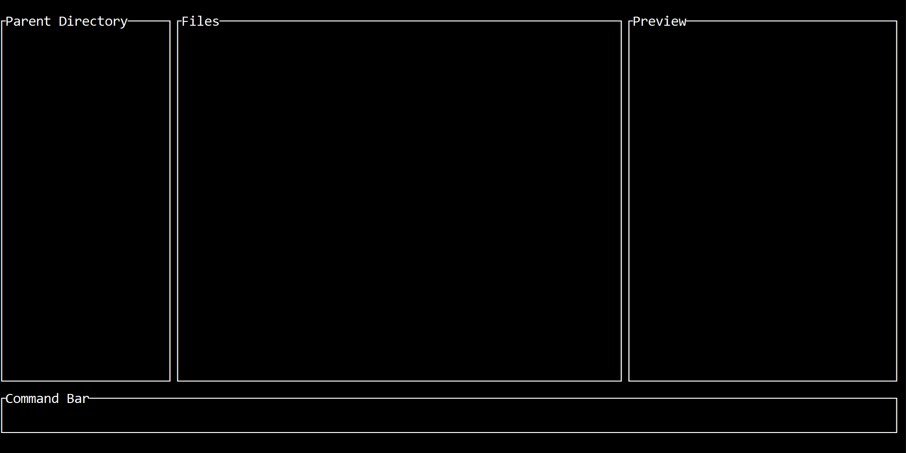

# RED - Rust Directory Explorer
#### work in progress

red is a terminal file manager written in Rust. It is highly inspired by the ranger file manager and lf file manager.

## Features

## Design Goals 

## Dependencies

## Installing
